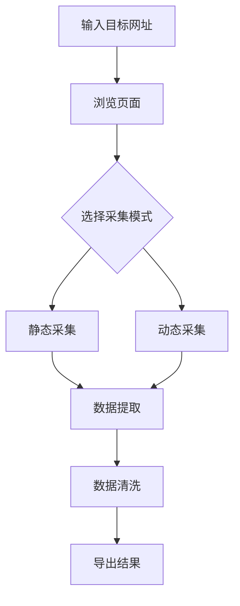

# 🌐 道衍AI浏览器 - 智能合规爬虫版

<div align="center">


**专为AI训练数据收集设计的智能浏览器**

[功能特性](#-功能特性) • [快速开始](#-快速开始) • [使用指南](#-使用指南) • [技术架构](#-技术架构) • [贡献指南](#-贡献指南)

</div>

## 📋 项目简介

**道衍AI浏览器**是一款集现代网页浏览、智能数据采集、下载管理于一体的综合性工具。专为AI训练数据收集、学术研究、内容分析等场景优化，提供直观的图形界面和强大的数据处理能力。

> **核心理念**：让数据采集变得简单、合规、高效

### 🎯 项目背景
- **概念提出**：张悦-玄曦雪
- **代码实现**：Deepseek AI
- **版本**：v3.0 专业版
- **许可证**：GPL-3.0

---

## ✨ 功能特性

### 🌐 核心浏览功能
| 功能 | 描述 | 状态 |
|------|------|------|
| 多标签页浏览 | 支持同时打开多个网页，独立管理 | ✅ 稳定 |
| 智能导航 | 前进、后退、刷新、主页等完整功能 | ✅ 稳定 |
| 地址栏搜索 | 自动识别网址和搜索关键词 | ✅ 稳定 |
| 页面缩放 | 支持页面放大、缩小和重置 | ✅ 稳定 |
| 开发者工具 | 内置开发者工具（F12快捷键） | ✅ 稳定 |

### 🕷️ 智能数据采集
| 采集模式 | 适用场景 | 特点 |
|----------|----------|------|
| 静态爬取 | 普通网页、新闻文章 | 速度快，资源占用低 |
| 动态爬取 | JavaScript渲染页面 | 完整渲染，支持交互 |
| 智能提取 | 自动识别主要内容 | 精准提取标题、正文 |
| 合规检查 | 自动检测robots.txt | 确保爬取行为合规 |

### 📚 数据管理
- **历史记录**：完整浏览历史，支持搜索和快速访问
- **书签管理**：一键收藏，支持导入导出
- **下载管理**：实时监控，支持暂停/继续
- **多格式导出**：JSON、TXT、DOCX等多种格式

### 🤖 AI增强功能
- **AI聊天助手**：集成多种AI模型对话
- **智能总结**：自动生成网页内容摘要
- **多模型支持**：GPT、Claude、DeepSeek等

### 🧩 扩展功能
- **插件系统**：可扩展的插件架构
- **局域网通信**：设备发现、公告系统
- **设置系统**：完整的配置管理

---

## 🚀 快速开始

### 系统要求
- **操作系统**：Windows 10/11, Linux, macOS
- **Python版本**：3.11+
- **内存**：4GB RAM（推荐8GB）
- **存储空间**：500MB可用空间

### 安装步骤

1. **克隆项目**
```bash
git clone https://github.com/your-username/ai-data-browser.git
cd ai-data-browser
```

2. **创建虚拟环境（推荐）**
```bash
python -m venv venv
# Windows
venv\Scripts\activate
# Linux/macOS
source venv/bin/activate
```

3. **安装依赖**
```bash
# 基础依赖
pip install PyQt5 PyQtWebEngine requests beautifulsoup4 lxml

# 完整功能（推荐）
pip install -r requirements.txt
```

4. **运行程序**
```bash
python liulanqi.py
```

### 可选配置
- **安装Chrome浏览器**：用于Selenium动态爬取
- **配置API密钥**：在设置中配置AI功能所需的API密钥

---

## 📖 使用指南

### 基础操作
1. **启动程序**：运行 `python liulanqi.py`
2. **浏览网页**：在地址栏输入URL或搜索关键词
3. **管理标签页**：使用 `Ctrl+T` 新建标签页
4. **数据采集**：点击"🕷️ 抓取当前页"按钮

### 数据采集流程


### 快捷键列表
| 功能 | 快捷键 | 说明 |
|------|---------|------|
| 新建标签页 | `Ctrl+T` | 快速新建空白页面 |
| 关闭标签页 | `Ctrl+W` | 关闭当前标签页 |
| 下载管理 | `Ctrl+J` | 打开下载管理器 |
| 历史记录 | `Ctrl+H` | 查看浏览历史 |
| 添加书签 | `Ctrl+D` | 保存当前页面到书签 |
| AI聊天 | `Ctrl+Shift+I` | 打开AI对话窗口 |
| 开发者工具 | `F12` | 调试和开发工具 |

### 数据导出示例
```python
# 导出为JSON格式（结构化数据）
{
    "title": "页面标题",
    "url": "https://example.com",
    "content": "提取的文本内容...",
    "word_count": 1500,
    "images": ["img1.jpg", "img2.png"]
}

# 导出为训练数据格式
"""
URL: https://example.com
标题: 页面标题
内容: 完整的文本内容...
"""
```

---

## 🏗️ 技术架构

### 系统架构
```
┌─────────────────┐    ┌──────────────────┐    ┌─────────────────┐
│   用户界面层     │    │   业务逻辑层      │    │   数据存储层     │
│                 │    │                  │    │                 │
│ • PyQt5 GUI     │◄──►│ • 浏览器引擎     │◄──►│ • 本地文件      │
│ • 标签页管理     │    │ • 爬虫调度       │    │ • 数据库        │
│ • 设置面板       │    │ • AI服务集成     │    │ • 缓存系统      │
└─────────────────┘    └──────────────────┘    └─────────────────┘
         │                        │                       │
         ▼                        ▼                       ▼
┌─────────────────┐    ┌──────────────────┐    ┌─────────────────┐
│   网络通信层     │    │   扩展功能层      │    │   外部服务层     │
│                 │    │                  │    │                 │
│ • HTTP客户端     │    │ • 插件系统       │    │ • AI API        │
│ • WebSocket     │    │ • 局域网通信      │    │ • 云服务        │
│ • 下载管理       │    │ • 安全加密       │    │ • 更新服务      │
└─────────────────┘    └──────────────────┘    └─────────────────┘
```

### 核心技术栈
| 组件 | 技术选型 | 用途 |
|------|----------|------|
| 图形界面 | PyQt5 + QtWebEngine | 现代化用户界面 |
| 浏览器内核 | Chromium | 网页渲染引擎 |
| 数据采集 | Requests + BeautifulSoup | 静态页面解析 |
| 动态渲染 | Selenium | JavaScript页面处理 |
| 文档处理 | python-docx | Word文档导出 |
| 网络通信 | 原生socket + HTTP | 局域网功能 |

---

## 🔧 故障排除

### 常见问题

**Q: 程序启动时报导入错误**
```bash
# 解决方案
pip install --upgrade PyQt5 PyQtWebEngine
```

**Q: 动态爬取功能无法使用**
```bash
# 安装Selenium相关依赖
pip install selenium webdriver-manager
# 确保已安装Chrome浏览器
```

**Q: 下载文件失败**
- 检查下载目录权限
- 确认磁盘空间充足
- 检查网络连接状态

**Q: AI功能无响应**
- 验证API密钥是否正确
- 检查网络连接
- 确认所选模型服务可用

### 日志调试
程序会在 `crawled_data/crawler.log` 生成详细日志，如需调试可查看该文件。

---

## 🤝 贡献指南

我们欢迎社区贡献！请阅读以下指南：

### 开发环境设置
1. Fork本项目
2. 创建功能分支：`git checkout -b feature/AmazingFeature`
3. 提交更改：`git commit -m 'Add AmazingFeature'`
4. 推送到分支：`git push origin feature/AmazingFeature`
5. 开启Pull Request

### 代码规范
- 遵循PEP 8编码规范
- 添加适当的类型提示
- 编写清晰的文档注释
- 确保向后兼容性

## 📝 提交信息格式规范

### 标准格式
```
类型(范围): 描述

详细说明（可选）

突破性变更: 描述（如有）
```

### 类型说明
| 类型 | 说明 | 示例 |
|------|------|------|
| `feat` | 新功能 | `feat(ai): 新增GPT-4模型支持` |
| `fix` | 修复bug | `fix(crawler): 修复动态页面解析错误` |
| `docs` | 文档更新 | `docs(readme): 更新安装指南` |
| `style` | 代码格式调整 | `style(ui): 调整按钮样式` |
| `refactor` | 代码重构 | `refactor(core): 重构浏览器核心模块` |
| `test` | 测试相关 | `test(plugin): 添加插件系统单元测试` |
| `chore` | 构建工具或依赖更新 | `chore(deps): 更新PyQt5到最新版本` |

### 范围说明
| 范围 | 说明 | 示例 |
|------|------|------|
| `browser` | 浏览器核心功能 | `feat(browser): 新增多标签页支持` |
| `crawler` | 数据爬取功能 | `fix(crawler): 修复robots.txt检测` |
| `download` | 下载管理 | `feat(download): 添加断点续传功能` |
| `ai` | AI功能集成 | `feat(ai): 集成Claude AI模型` |
| `plugin` | 插件系统 | `refactor(plugin): 优化插件加载机制` |
| `lan` | 局域网通信 | `feat(lan): 添加设备发现功能` |
| `ui` | 用户界面 | `style(ui): 优化暗色主题` |
| `security` | 安全相关 | `fix(security): 修复XSS漏洞` |

### 突破性变更说明
当提交包含不向后兼容的变更时，必须使用`突破性变更:`部分。

#### 局域网通信相关
```
feat(lan): 重构局域网通信协议

详细说明：
- 使用WebSocket替代原始socket通信
- 增加消息加密机制
- 优化设备发现算法

突破性变更: 
- 旧版本客户端无法与新版本通信
- 需要重新配置网络端口
- 设备发现机制完全重构
```

#### 插件系统相关
```
refactor(plugin): 重构插件架构

详细说明：
- 引入新的插件元数据格式
- 支持热重载插件
- 增加插件沙箱安全机制

突破性变更:
- 旧版插件需要更新manifest.json格式
- 插件API接口完全重构
- 移除对Python 2.x插件的支持
```

#### AI接入系统相关
```
feat(ai): 统一AI模型接入接口

详细说明：
- 创建统一的AI提供者接口
- 支持流式响应
- 增加模型健康检查

突破性变更:
- 自定义AI模型需要实现新的BaseProvider接口
- AI配置格式变更，需要手动迁移
- 移除对旧版OpenAI API的支持
```

### 完整示例

#### 示例1：新功能（无突破性变更）
```
feat(ai): 新增通义千问模型支持

详细说明：
- 集成通义千问API v2.0
- 支持流式对话响应
- 添加模型配置界面

突破性变更: 无
```

#### 示例2：修复（含突破性变更）
```
fix(plugin): 修复插件安全漏洞

详细说明：
- 修复插件沙箱逃逸漏洞
- 增加插件权限验证
- 优化插件加载性能

突破性变更:
- 所有插件需要重新签名
- 插件manifest必须包含权限声明
- 移除不安全的eval()函数支持
```

#### 示例3：重构（含详细说明）
```
refactor(lan): 优化局域网通信性能

详细说明：
## 问题描述
旧版局域网通信在高延迟网络下性能较差

## 解决方案
- 实现消息压缩机制
- 增加连接池管理
- 优化心跳检测算法

## 性能提升
- 消息传输速度提升40%
- 内存使用减少25%
- 连接稳定性显著改善

突破性变更:
- 通信协议版本升级到v2
- 需要更新所有局域网节点
- 配置文件格式变更
```

#### 示例4：AI系统重大更新
```
feat(ai): 实现多模型负载均衡

详细说明：
## 功能特性
- 支持同时配置多个AI提供商
- 智能路由请求到可用模型
- 故障自动切换机制

## 配置示例
```json
{
  "providers": [
    {"name": "openai", "weight": 50},
    {"name": "claude", "weight": 30},
    {"name": "deepseek", "weight": 20}
  ]
}
```

突破性变更:
- AI设置界面完全重构
- 需要重新配置所有API密钥
- 移除单模型配置模式
```

### 提交信息最佳实践

1. **标题简洁明了**
   - ✅ `feat(ai): 新增多模型支持`
   - ❌ `在AI系统中添加了多个模型的支持功能`

2. **详细说明结构化**
   - 使用Markdown格式
   - 分节描述问题、解决方案、影响
   - 包含代码示例或配置示例

3. **突破性变更明确**
   - 列出所有不兼容变更
   - 提供迁移指南或说明
   - 标注影响范围

4. **关联Issue**
   - 在详细说明中引用相关Issue
   - 使用 `Closes #123` 或 `Fixes #456`

### 模板文件
在项目根目录创建 `.git-commit-template.txt`：

```
# 提交信息模板
# 类型: feat|fix|docs|style|refactor|test|chore
# 范围: browser|crawler|ai|plugin|lan|ui|download|security

类型(范围): 一句话描述

## 详细说明
（可选，描述修改的详细内容、解决的问题等）

## 测试说明
（描述如何测试这个修改）

突破性变更: 
（如有不兼容变更，请详细说明）

关联Issue: #123, #456
```

使用模板：
```bash
git config commit.template .git-commit-template.txt
```

这样规范的提交信息将有助于：
- 自动生成变更日志
- 快速定位问题原因
- 便于代码审查
- 简化版本管理

---

## 📄 许可证

本项目采用 **GNU General Public License v3.0 (GPL-3.0)** 许可证。

**主要条款：**
- ✅ 允许自由使用、修改和分发
- ✅ 必须提供修改后的源代码
- ✅ 衍生作品必须采用相同许可证
- ✅ 必须保留原始版权声明

**商业使用：** 允许商业使用，但必须遵守GPL-3.0条款。

完整许可证文本请查看 [LICENSE](LICENSE) 文件。

---

## 🌟 致谢

### 特别感谢
- **张悦-玄曦雪** - 项目概念提出者和灵感来源
- **Deepseek AI** - 代码实现和技术支持
- **开源社区** - 感谢所有依赖库的维护者

### 使用的开源库
| 库名称 | 用途 | 许可证 |
|--------|------|--------|
| PyQt5 | 图形界面框架 | GPL |
| Requests | HTTP请求库 | Apache 2.0 |
| BeautifulSoup4 | HTML解析 | MIT |
| Selenium | 浏览器自动化 | Apache 2.0 |
| python-docx | Word文档处理 | MIT |

---

## 📞 支持与反馈

如果您在使用过程中遇到问题：

1. **查看文档**：仔细阅读本文档和相关注释
2. **检查日志**：查看程序生成的日志文件
3. **提交Issue**：在GitHub Issues页面描述问题
4. **社区讨论**：参与项目讨论和交流

### 提交Issue时请提供：
- 操作系统和Python版本
- 完整的错误信息和堆栈跟踪
- 复现问题的详细步骤
- 相关截图或日志文件

---

## 🚀 发展路线图

### 近期计划
- [ ] 更强大的插件生态系统
- [ ] 批量爬取任务管理
- [ ] 数据分析和可视化面板
- [ ] 云同步功能

### 长期愿景
- [ ] 分布式爬取架构
- [ ] 机器学习内容分类
- [ ] 多语言支持
- [ ] 移动端应用

---

<div align="center">

## 🎉 开始使用

**道衍AI浏览器 - 让数据采集变得更简单、更智能！**

[快速开始](#-快速开始) • [报告问题](https://github.com/your-username/ai-data-browser/issues) • [参与贡献](#-贡献指南)

*最后更新：2025年11月5日*

</div>
